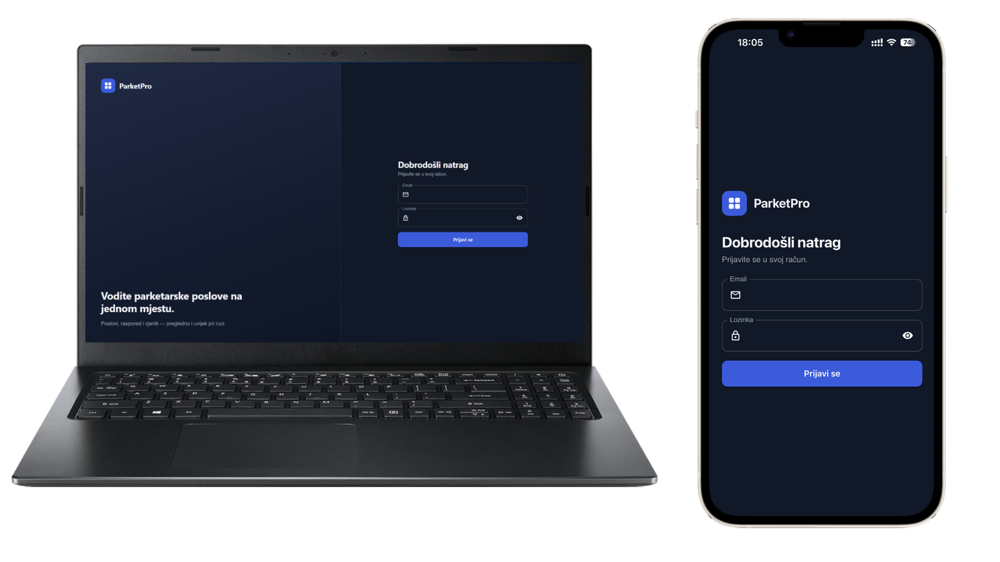
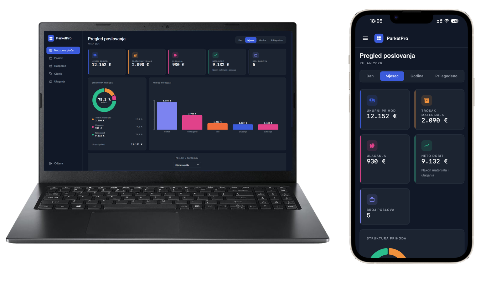
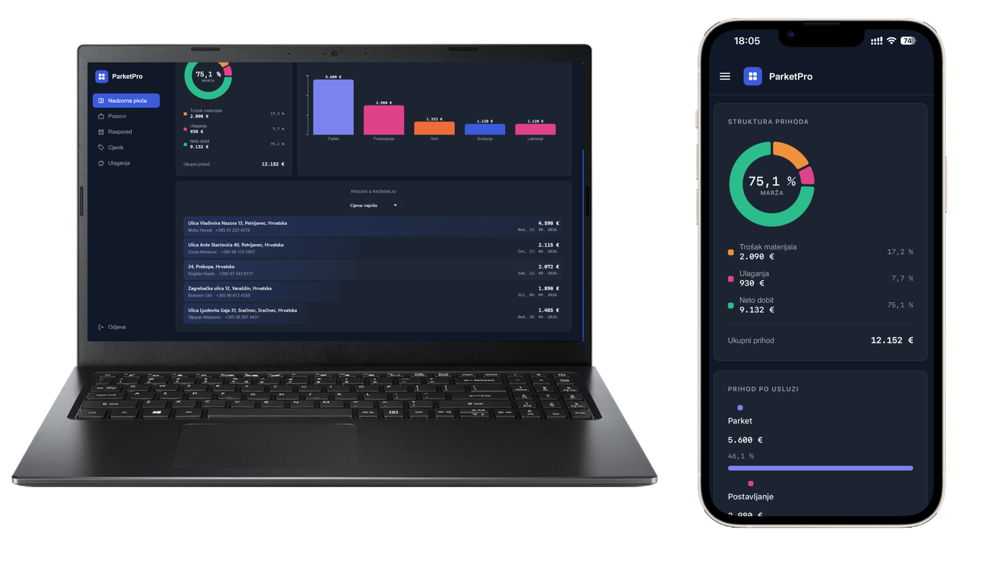
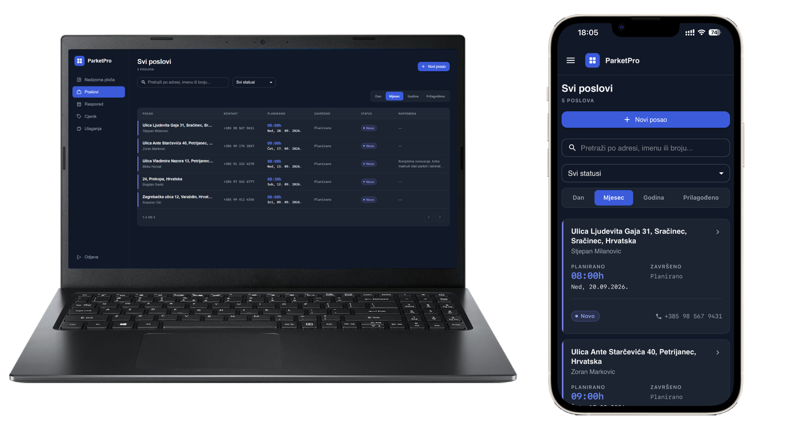
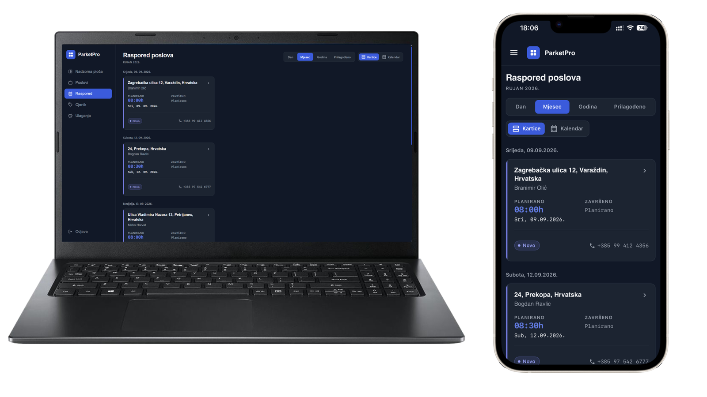
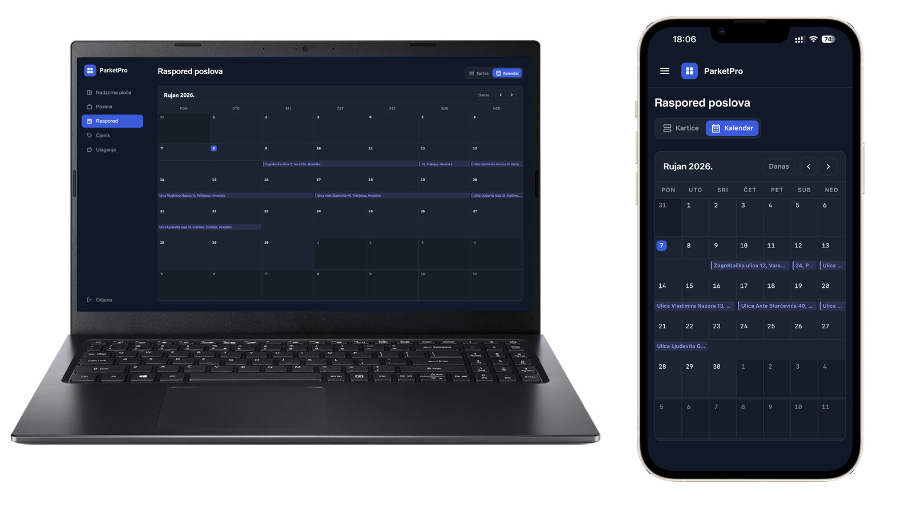
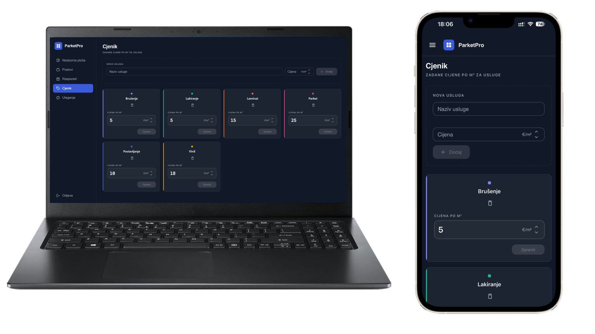
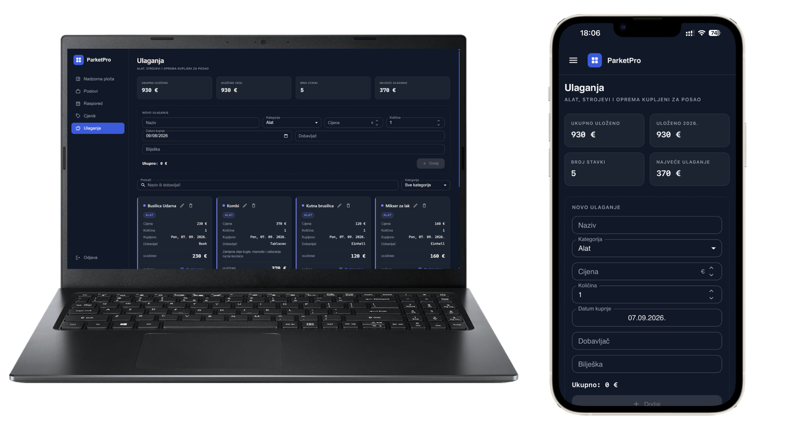

<div align="center">


# ProParket

**Job management for flooring contractors — jobs, scheduling, photos and profit tracking in one app.**

[**🔗 Live app — pro-parket.vercel.app**](https://pro-parket.vercel.app) · Demo login: `demo@gmail.com` / `demo1234`

[](https://react.dev)
[](https://www.typescriptlang.org)
[](https://vite.dev)
[](https://mui.com)
[](https://supabase.com)
[](https://vite-pwa-org.netlify.app)
[](https://pro-parket.vercel.app)

</div>

---

## What it is

An App that replaces the notebook a flooring contractor runs their business out of. It is in daily
use by **paušalni obrt Flajsman**, a Croatian flooring contractor. The interface is in Croatian.

## How it works

- A job holds its client, address, schedule, rooms, services and photos.
- Every room breaks into services priced **per m²** — that is how quotes are given on site.
- Those lines roll up into revenue, material cost and net profit on the dashboard, for any period you pick.
- Tools and machines go on the Investments page and are subtracted from profit, so the number on the
  dashboard is what actually stays in your pocket.
- It is an installable PWA with a dark, mobile-first UI — made to be used on a phone, on site.

## Tech

React 19 · TypeScript · Vite · MUI 9 + MUI X Charts · TanStack Query · Supabase (Postgres, Auth, Storage)
· React Router 7 · Valibot · Google Places API · `vite-plugin-pwa` · deployed on Vercel.

---

## Screenshots

### Login



### Dashboard — revenue, material cost, investments and net profit for the selected period



### Dashboard — profit structure, revenue per service and jobs in the period



### Jobs — searchable, filterable, paginated job list



### Schedule — jobs grouped by day



### Schedule — month calendar



### Price list — default price per m² per service



### Investments — tools, machines and equipment bought for the business



---

## Run it locally

Needs Node 20+, a Supabase project (with a public `job-photos` bucket) and a Google Maps key with
**Places API (New)** enabled.

```bash
git clone https://github.com/bernardkrehula/ProParket.git
cd ProParket
npm install
npm run dev
```

`.env` in the project root:

```bash
VITE_SUPABASE_URL=https://your-project.supabase.co
VITE_ANON_KEY=your-supabase-anon-key
VITE_GOOGLE_MAPS_PLACES_API_KEY=your-google-maps-key
VITE_GOOGLE_MAPS_MAP_ID=your-map-id          # optional
```

---

<div align="center">

**Bernard Krehula** · [GitHub](https://github.com/bernardkrehula)

</div>
